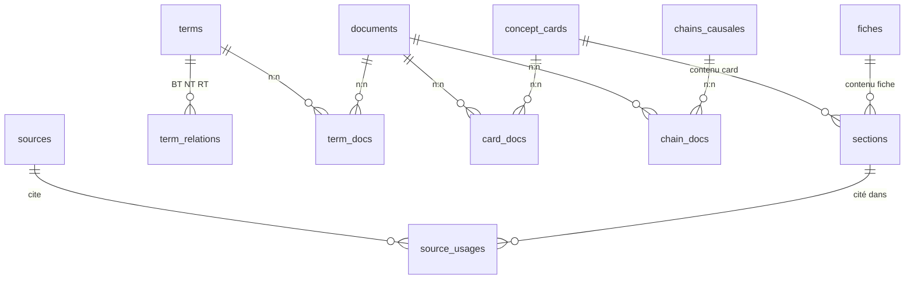
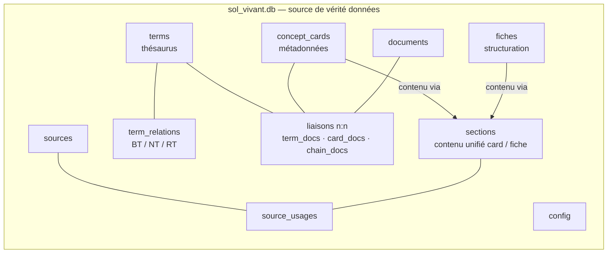
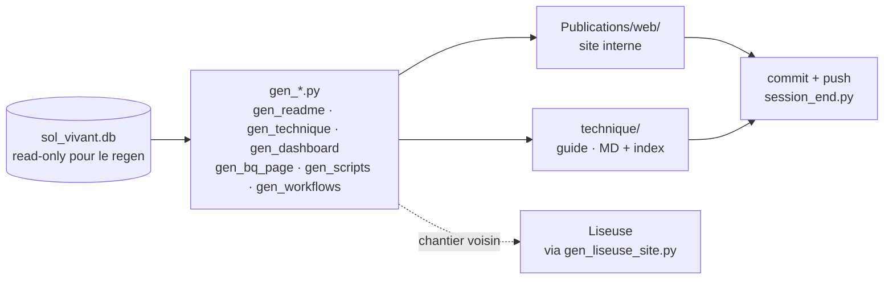
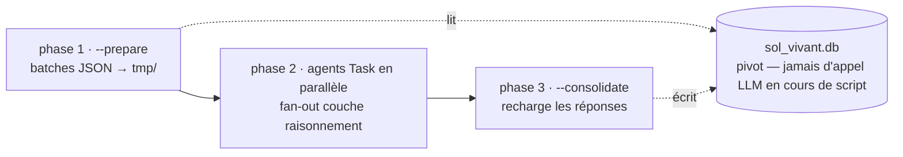
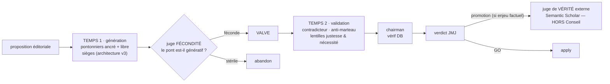
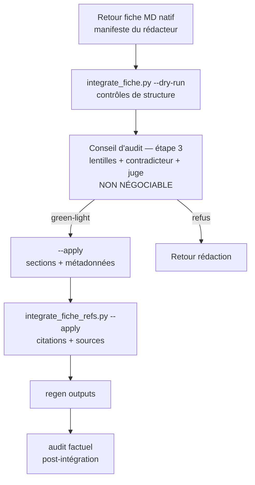
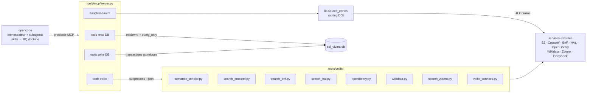

# Architecture technique — Le Sol Vivant cet Holobionte

Trois piliers : la **DB** (`sol_vivant.db`, source de vérité données), les **scripts** (`tools/`, versionnés git, source de vérité code), et les **agents** (orchestrateur + subagents, routés par `config.agent_library`). Ce guide est une porte d'entrée synthétique : la doctrine détaillée vit dans la BQ (recherche au fil de l'eau via `bq_query.py`), pas ici.

## 1. Base de données : sol_vivant.db

Source de vérité **données**. SQLite, 68 tables, 14 vues (compteurs live au regen). Fichier binaire (~50 Mo), **exclu de git** depuis 2026-06-22 (décision `db_backup_strategy`) : le versioning se fait via `backups/sol_vivant.sql.gz` (dump SQL compressé, régénéré à chaque clôture par `session_end.py`). Restauration : `gunzip -c backups/sol_vivant.sql.gz | sqlite3 sol_vivant.db`.

## 2. Table `sections` — le pivot du contenu

Le contenu textuel (cards, fiches) vit dans **une table unifiée** `sections` — `entity_type` ∈ {card, fiche} (CHECK contraint en base, normalisation P7 2026-08). `concept_cards` (métadonnées) et `fiches` (structuration) référencent `sections` pour leur contenu : un seul schéma de section, moteur de rendu unique. Les chaînes causales gardent leur narratif dans `chains_causales.valeur_ajoutee` (clé TEXT, non migrables dans sections).

| entity_type | Sections |
|-------------|----------|
| `card` | 272 |
| `fiche` | 8141 |
| **total** | 8413 |

**Vues** (14 au total) — principales : `v_concept_cards` (title/description des cards depuis sections — les colonnes `concept_cards.title/.description` sont DROPPÉES), `fiche_retour_sections` (sections fiche), `v_terms_full`, `v_term_relations`, `v_avancement`/`v_sante` (instrumentation, basculées sur `term_docs` en P1). Piège canonique : lire via les vues, jamais via des colonnes disparues (BQ `architecture_db_tables_vues_colonnes_cles`).

## 3. Tables par bloc fonctionnel

### Noyau corpus

| Table | Role | Rows |
|-------|------|------|
| `documents` | Documents de strate (ossature pédagogique) | 18 |
| `prompts` | Structure des sections (héritage v3 — gelé) | 192 |
| `terms` | Thésaurus canonique (FR/EN, definitions) — hors classes de structure | 6861 |
| `term_relations` | Relations BT/NT/RT entre termes | 29344 |
| `chains_causales` | Chaînes causales reliant les documents | 49 |
| `chain_etapes` | Étapes des chaînes | 321 |
| `config` | Paramètres centralisés (toutes catégories) | 352 |
| `audit_log` | Journal des opérations (traçabilité) | 4243 |
| `db_meta` | Historique (audits, scores, todos) | 11 |
| `doc_specs` | Spécifications document (style) | 18 |

### Workflow fiches et sourçage

| Table | Role | Rows |
|-------|------|------|
| `fiches` | Unité de production éditoriale (slug, type, statut) | 336 |
| `fiche_articulations` | Articulations inter-fiches (pivot, direction) | 680 |
| `sources` | Bibliothèque bibliographique (DOI, auteurs, abstracts) | 10680 |
| `source_usages` | Citations inline rattachées aux entités | 21714 |
| `validations` | Workflow de validation / questions de sourçage | 19 |
| `refs` | Évidence chiffrée typée (kind, valeur, source_id) | 364 |
| `ref_links` | Liens refs ↔ targets sur `ref_uid` seul (FK ON DELETE CASCADE, normalisation P3) | 1290 |
| `fiche_retour_sections` *(vue)* | Sections fiche (compatibilité) | 8141 |

### Liaisons n:n et référentiels (normalisation 2026-08, P1-P7)

Plan de normalisation P1→P7 appliqué 2026-08-15 (arbitrage JMJ, audit GLM 5.3 + Conseil) : les liaisons polymorphes legacy deviennent des tables n:n canoniques avec FK.

| Table | Role | Rows |
|-------|------|------|
| `term_docs` | Liaison terme ↔ document (n:n) — remplace `terms.doc_code` (colonne dépréciée, conservée pour compat lecteurs) | 4006 |
| `card_docs` | Liaison card ↔ document (n:n, depuis docs_codes JSON) | 542 |
| `chain_docs` | Liaison chaîne ↔ document (n:n, depuis docs_traverses texte) | 203 |
| `doc_card_links` | Liaison document ↔ card avec rôle/ordre (ex-pedago_links type=doc, P4) | 26 |
| `strates` | Référentiel strates F/S/V/P/H (P7) — référencé par documents.strate FK (P8, 2026-08-15) | 5 |
| `diagnostic_rule_terms` | Termes des règles diagnostiques (FK term_id backfillée, pont terrain) | 24 |

### Fil directeur et graphe conceptuel

| Table | Role | Rows |
|-------|------|------|
| `doctrine_chantiers` | **Fil directeur** : thèses fédératrices, principes racines, chantiers | 26 |
| `concept_dimensions` | Dimensions transversales des cards | 12 |
| `concept_cards` | Fiches conceptuelles synthétiques (métadonnées) | 272 |
| `concept_card_links` | Graphe de liens card ↔ card (7 types) | 1257 |
| `card_chain_links` | Rattachement cards ↔ chaînes causales | 769 |
| `cascade_level_links` | Rattachement entités ↔ niveaux de cascade | 146 |
| `pedago_links` | Liens pédagogiques card ↔ fiche/doc | 1841 |

### Web et outils interactifs

| Table | Role | Rows |
|-------|------|------|
| `web_pages` | Pages web (slug, titre, OG tags) | 14 |
| `html_templates` | Templates CSS/JS par page + partagés | 35 |
| `diagnostic_rules` | Règles diagnostiques sol | 26 |
| `cascade_prerequis` | Niveaux de la cascade de prérequis (logique, seuils) | 6 |
| `terrain_tests` | Tests de terrain (protocoles diagnostiques) | 25 |
| `test_scales` | Échelles pédagogiques des tests (ordinal/numérique/observation, repères sourcés — pas de verdict) | 27 |
| `illustration_prompts` | Prompts d'illustrations et schémas Mermaid (cible corpus / guide) | 30 |
| `refs` (kind=matiere) | Matières organiques (C/N, k1, NPK) | 112 |
| `refs` (kind=texture) | Classes texturales GEPPA | 14 |

### Déploiement web

- **Vendor local** : `Publications/web/vendor/` (React, Babel, Mermaid — hors-ligne)
- **Charte CSS** : `web_template.py` (CHARTER_CSS + composants sv-*) (doctrine BQ `web_charte`)
- **Déploiement** : `rsync -av Publications/web/ <cible>/` → GitHub Pages ; Liseuse (site + PWA + exports) via `tools/liseuse/build.sh`

## 4. Config centralisée (table `config`)

352 clés réparties en 33 catégories (règle : tout paramètre partagé entre scripts vit en DB, jamais en dur dans le code). Principales catégories :

| Catégorie | Rôle |
|-----------|------|
| `corpus`, `strates` | Identité du corpus et strates pédagogiques |
| `technique` | Contenu du guide technique (`chapitres` — les schémas vivent dans `illustration_prompts` cible guide) |
| `agent_library` | Routing des subagents : modèle/effort/thinking par agent (résolution override → groupe → défaut, cf. §7) |
| `api` | Services externes (UID Zotero, URL bases, timeouts) |
| `audit`, `web`, `analyse` | Paramètres audits, charte web, pipelines |

Consultation live : `SELECT categorie, cle, valeur FROM config ORDER BY categorie, cle;` (énumération complète volontairement omise — elle périmerait ici).

## 5. Scripts (tools/)

162 scripts Python, inventaire **filesystem** via `tools/lib/scripts_inventory.py::list_scripts()` (la table `scripts` a été droppée Session B : la sync DB↔fichiers se désynchronisait silencieusement). Organisation par module :

| Module | Scripts | Rôle |
|--------|---------|------|
| `admin/` | 67 | Sessions (start/end), intégrité, BQ, gestion agents |
| `batch/` | 1 | Pipelines d'inférence 3 phases (fan-out agents) |
| `docs/` | 14 | Générateurs README/manifest/dashboard/technique |
| `integration/` | 12 | Intégration fiches MD + termes thésaurus (Conseil) |
| `lib/` | 46 | Modules partagés (config, pub_path, agent_runner…) |
| `liseuse/` | 1 | Chantier Liseuse (cf. §13) |
| `liseuse/lib/` | 2 |  |
| `mcp/` | 1 | MCP server — tools exposés aux agents (cf. §6) |
| `migration/` | 4 |  |
| `racine/` | 3 |  |
| `veille/` | 11 | Clients API externes (S2, Crossref, BnF…) en --json |

Listing exhaustif régénéré : `python3 tools/docs/gen_scripts.py --db sol_vivant.db` (page web du même nom) — jamais figé ici.

## 6. MCP server (tools/mcp/server.py)

27 tools exposés aux agents via le protocole MCP (comptés au regen sur `server.py` — jamais figés) :

| Catégorie | Tools | Sécurité |
|-----------|-------|----------|
| **Read DB** (5) | `db_query`, `db_schema`, `search_corpus`, `run_audit`, `audit_fiche` | Double sécurité : ouverture `mode=ro` URI + `PRAGMA query_only=ON` |
| **Write DB** (8) | `write_section`, `create_card/fiche/term/chain`, `link_cards`, `link_card_chain`, `link_terms` | Transactions atomiques ; deny par défaut pour les agents veille/validation |
| **Enrichissement** (3) | `enrich_abstracts`, `enrich_source_fields`, `resolve_inline_citations` | Routing DOI multi-source (CrossRef/S2/HAL/OpenLibrary) |
| **Veille** (11) | `veille_s2_*`, `veille_crossref/bnf/hal_search/hal_ref/openlibrary/zotero/wikidata`, `veille_health` | Wrappent `tools/veille/*.py` en `--json` |

Détail du mapping tool → script → service externe : `api_externes.md` §Couche MCP. Les interactions complètes (MCP ↔ API ↔ SGBD ↔ scripts) : §12.

## 7. Bibliothèque d'agents

41 agents déclarés dans `.opencode/agents/`, 31 activés — routés via `config.agent_library` (compteurs live). **Résolution du modèle en 3 niveaux** : override par agent → groupe (raisonnement/technique) → défaut. Bascule quota : `python3 tools/admin/agents_model_switch.py --groupe <g> --model <m> --apply` (dry-run par défaut, réversible). Frontmatters régénérés par `gen_agents_md.py`.

**Pattern `agent_runner.py` — 3 phases** (inférence en masse, N>5) : `--prepare` écrit les batches JSON dans `tmp/<script>/` → l'utilisateur lance les agents Task en parallèle → `--consolidate` recharge les réponses. Jamais d'appel LLM en cours de script : la DB sert de pivot.

**Garde-fou** (règle `pas_agent_redacteur`) : les agents sont read-only par défaut ; la rédaction éditoriale ne se fait que sur instruction explicite, sous supervision. Doctrine complète : BQ `wf_agents_library`, `strategie_agents`.

## 8. Dispositif Conseil

Délibération en **deux temps séparés par une valve** (architecture v3, sièges typés) : **Temps 1** génération, jugée à la **fécondité** → valve → **Temps 2** validation, jugée **justesse & nécessité** → vérif chairman → verdict JMJ. **Règle dure** : le Conseil ne tranche jamais la vérité — il **promeut** une hypothèse vers le juge externe de vérité, **Semantic Scholar** (évidence brute, HORS Conseil). Doctrine : BQ `conseil_modele` (vue d'ensemble : `conseil_overview`). Obligatoire avant toute intégration (règle `integration_conseil_audit`).\n

## 9. Skills opencode

11 skills dans `.opencode/skills/` (compteur live), auto-surface au démarrage selon le contexte — ne pas tous charger en même temps. Chaque skill charge le briefing de son chantier (BQ de référence + scripts + pièges canoniques).

`audit`, `compose`, `db-query`, `discovery`, `fiche-plan`, `integrate-fiche`, `integrate-terms`, `session-flow`, `thesaurus-edit`, `web-edit`, `web-regen`

## 10. Pipelines canoniques

Table de routage des chantiers typiques (version condensée — table complète et pièges canoniques : AGENTS.md §Routage des chantiers typiques).

| Chantier | Skill | Scripts clés |
|----------|-------|--------------|
| Session (démarrage/clôture) | `session-flow` | session_start.py, session_end.py |
| Audit corpus/thésaurus | `audit` | analyse_corpus.py, audit_focus.py |
| Intégration fiche MD | `integrate-fiche` | integrate_fiche.py (+Conseil obligatoire) |
| Plan de fiche H1/H2 | `fiche-plan` | fiche_plan.py |
| Intégration thésaurus | `integrate-terms` | import_termes.py, dedupe_thesaurus.py |
| Édition terme isolé | `thesaurus-edit` | SQL direct après audit + term_rels.py |
| Regen outputs | `web-regen` | regen_all.py, gen_*.py |
| Édition UI web | `web-edit` | html_templates (UPDATE DB), gen_*.py |
| Requête DB / BQ | `db-query` | bq_query.py, check_integrity.py |
| Découverte (couverture) | `discovery` | discover_coverage.py |

## 11. Tableau de bord et instrumentation

La confusion « le dashboard n'est jamais à jour » vient de **3 sources d'instrumentation distinctes** :

- **(a) `session_start.py`** — **aucun dashboard** (allégé). Opérationnel uniquement : état git, backup DB + WAL checkpoint, purge opencode.db.

- **(b) Page web `dashboard.html`** (`tools/docs/gen_dashboard.py`) — régénérée par `regen_all.py` à chaque clôture → `Publications/web/dashboard.html`. 7 sections : vital signs, avancement production, dettes techniques, chantiers récents, ressources, intégrité détaillée, doctrine (BQ `is_critique`).

- **(c) Briefing `session-scribe`** — paperasse analytique complète (santé DB, intégrité, état des audits, recap précédent), à chaque `/session-start`.

**Politique de fraîcheur** : (b) est fraîche à chaque clôture ; pour un audit intermédiaire : `python3 tools/docs/gen_dashboard.py --db sol_vivant.db` ; (c) est live à chaque démarrage.

## 12. Interactions MCP / API / SGBD / scripts

Qui appelle quoi, qui lit, qui écrit :

1. **MCP → SGBD (lecture)** : tools read DB — `mode=ro` + `query_only`, aucune mutation possible.

2. **MCP → SGBD (écriture)** : tools write DB — transactions atomiques (ex. `create_card` = `concept_cards` + `sections`, rollback si échec) ; deny par défaut pour les agents veille/validation, l'orchestrateur arbitre.

3. **MCP → scripts veille → API** : tools `veille_*` → subprocess `tools/veille/*.py --json` (enveloppe `{ok, source, query, count, results, errors}`). Mapping complet : `api_externes.md` §Couche MCP.

4. **MCP → enrichissement** : `enrich_abstracts`/`enrich_source_fields` routent par type de DOI (`lib/source_enrich.route_doi`) : papers → CrossRef puis S2 ; livres → OpenLibrary puis CrossRef ; HAL → HAL API ; preprints → S2.

5. **Scripts hors MCP → SGBD** : accès direct `sqlite3` (admin/batch/docs/integration), écritures tracées `audit_log`. Inférence : pattern 3 phases (§7).

6. **Regen → SGBD** : les `gen_*.py` lisent la DB et écrivent les outputs — jamais l'inverse (règle `db_source_de_verite`).

7. **Agents couche 2 → MCP veille** : `validator-s2`, `validator-crossref`, `scholar-searcher`, `zotero-sync`, `detector-emergences`, `weaver-thesaurus` préfèrent les tools MCP `veille_*` au bash ; write DB deny dans leurs permissions.

| Acteur | SGBD | Fichiers | API |
|--------|------|----------|-----|
| Orchestrateur | MCP write / scripts | code, rapports | MCP veille |
| Subagents read-only (défaut) | SELECT seul (MCP read) | rapports via `agent_report.py` | veille via MCP |
| Scripts veille | cache enrich | — | services externes |
| Scripts admin/intégration | read/write + audit_log | outputs regen | — |
| gen_*.py (regen) | read seul | MD/HTML générés | — |

## 13. Liseuse — chantier voisin, indépendant

La **Liseuse** (`feat/liseuse` → `dist/`) est le point d'entrée **public** du corpus (296 pages, site statique Astro + PWA + exports). Elle est **indépendante** de ce guide : aucun build Node/Astro ici, aucune dépendance à `dist/` ou `data/bundle/` — et réciproquement. Le guide réutilise seulement l'infrastructure partagée du site interne (`render_page`, `sv-header`, nav bar, vendor `../web/vendor/`).

Doctrine complète : `tools/liseuse/README.md` + BQ `architecture_liseuse`. La DB est read-only pour la Liseuse (dérivé de build, jamais source).

## Reproduire le patron pour un autre corpus

L'architecture est indépendante du domaine (DB SQLite + orchestrateur + scripts réutilisables) — guide dédié : `reproduire_le_patron.md`.
