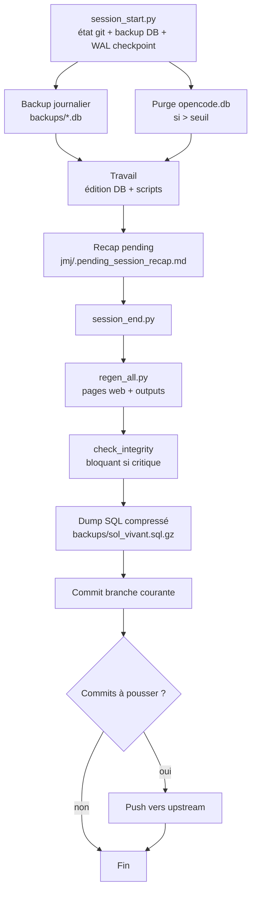

# Gestion des sessions — guide d'usage

Ce guide documente le cycle complet d'une session de travail sur le corpus Sol Vivant : démarrage, développement, clôture. Il liste aussi les règles actives (lues depuis `.opencode/RULES.md`) et les modules de la Bibliothèque de Connaissances (BQ) disponibles.

## Contexte

Le projet est **mono-utilisateur** avec une DB SQLite binaire (`sol_vivant.db`) qui est la **source de vérité données** (le code des scripts est versionné par git). Les pages HTML, les README et les exports ne sont que des projections régénérables. Ce qui n'est pas en base n'existe pas.

Chaque session démarre par `session_start.py` qui affiche l'état git (branche, working tree, ahead/behind) **sans reset ni checkout** — l'agent ne modifie jamais la topologie git. La DB binaire (`sol_vivant.db`) est la source de vérité, exclue de git depuis 2026-06-22 et versionnée via `backups/sol_vivant.sql.gz`.

## Cycle d'une session

### 1. Démarrage

```bash
python3 tools/admin/session_start.py --db sol_vivant.db
```

**Un seul régime (CLI local opencode, paradigme courant)** :
- `session_start.py` affiche l’état git (branche, working tree, ahead/behind) **sans reset ni checkout**. L’utilisateur gère sa sync avec origin lui-même ; l’agent ne fait jamais de `git reset --hard`, `git checkout`, ou `git push --force` (doctrine **local-first**, cf. AGENTS.md §Règles absolues).
- *(Historique)* l’ancien régime « session web » (conteneur éphémère, branche imposée par la plateforme) est **obsolète** depuis le passage à opencode CLI — cf. règles supprimées dans `.opencode/RULES.md`.

Puis : backup DB journalier (WAL checkpoint TRUNCATE) + purge `opencode.db` si > seuil. **Aucun dashboard** — `session_start.py` est allégé, opérationnel uniquement.

### Instrumentation — les 3 sources

La confusion « le dashboard n’est jamais à jour » vient de 3 sources d’instrumentation distinctes :

- **(a) `session_start.py`** — **aucun dashboard** (allégé). Opérationnel uniquement : état git (informationnel), backup DB + WAL checkpoint, purge.

- **(b) Page web `dashboard.html`** (`tools/docs/gen_dashboard.py`) — régénérée par `regen_all.py` à chaque clôture. Consultable : `Publications/web/dashboard.html`. 7 sections : vital signs, avancement production, dettes techniques, chantiers récents, ressources, intégrité détaillée, doctrine (BQ `is_critique`).

- **(c) Briefing `session-scribe`** — paperasse analytique complète (santé DB, intégrité, état des audits, recap précédent), déléguée par design au subagent à chaque `/session-start`.

Pour un audit intermédiaire : `python3 tools/docs/gen_dashboard.py --db sol_vivant.db`.

### 2. Développement

Toutes les modifications (DB + scripts) s’accumulent sur la branche courante, laissée à la discrétion de l’utilisateur (mono-utilisateur, DB binaire — un seul éditeur à la fois).

**Regle** : on édite la DB (`config`, `concept_cards`, `terms`, fiches… ; `html_templates` pour le web) + les scripts Python (versionnés par git dans `tools/`), **jamais** les fichiers générés (HTML, README, MD). Plus de table `scripts` ni de sync DB↔fichiers depuis Session B.

### 3. Clôture

La clôture est **scriptée**, jamais manuelle. En CLI local, le working tree sale est accepté par défaut (git add -A l'incluera dans le commit).

```bash
python3 tools/admin/session_end.py --db sol_vivant.db           # session substantielle
python3 tools/admin/session_end.py --db sol_vivant.db --short   # session courte
```

Le script enchaîne : session recap → regen pages web → `check_integrity` (bloquant si failed/critique) → purge `audit_log` → dump SQL compressé (`backups/sol_vivant.sql.gz`) → commit (`git add -A`, message structuré) → push branche courante vers son upstream.

**Local-first** : le working tree sale est normal (on travaille dessus), git gère le versioning. `--require-clean` pour l'ancien comportement strict. `--short` pour les sessions courtes (skip regen + integrity + dump). L'agent ne force jamais la topologie git (pas de checkout main, pas de merge FF, pas de force-with-lease) — JMJ arbitre les fusions lui-même.



## Dispositifs transverses (détail : règles actives + BQ)

- **Conseil** — dispositif de délibération en **deux temps séparés par une valve** (cf. BQ `conseil_modele`, architecture v3, sièges typés) : génération jugée à la **fécondité** → valve → validation jugée justesse/nécessité → vérif chairman → verdict JMJ. Le Conseil ne tranche **jamais** la vérité : il promeut une hypothèse vers le juge externe de **vérité** — **Semantic Scholar** (évidence brute, HORS Conseil). Règles : `conseil_contradicteur`, `integration_conseil_audit`, `ouverture_conseil` ; BQ : `conseil_modele`.
- **Agents Task** — pour N>5 items LLM indépendants : pattern `agent_runner.py` en 3 phases (`--prepare` → agents Task en parallèle → `--consolidate`) ; toujours `model='deepseek-v4-pro'` par défaut. **Interdits** pour la rédaction éditoriale du corpus (`pas_agent_redacteur`).
- **Ouverture de session** — lire le dernier handoff de clôture (`jmj/rapports/session/`) puis tenir le Conseil sur les arbitrages ouverts AVANT d'agir (`ouverture_conseil`).

## Règles actives

Stockées dans le fichier `.opencode/RULES.md` (versionné Git depuis 2026-06-23) — **source de vérité** des réflexes opérationnels transversaux, consultable directement et chargée par les skills au contexte. Pour ajouter ou modifier une règle : éditer le fichier, effet immédiat.

```bash
# Éditer le fichier directement
vi .opencode/RULES.md
```

**Règles actives (57 règles, 12 sections)** :

- **Session** — `ouverture_conseil`, `cloture_pending_recap`, `yaml_apostrophes`, `audit_reflex`

- **DB & code** — `wal_checkpoint`, `db_fk_cascade_manuel`, `compteurs_corpus_pas_en_dur`, `source_verite_data_avant_absence`, `bq_source_verite`, `corpus_centre_verite`, `timestamp_iso_audit_log`, `reverif_db_avant_apply`

- **BQ & consultation** — `bq_access`

- **Thésaurus** — `thesaurus_carte`, `pas_classifier_sans_s2_count_based`, `pas_modif_fr_canonique`, `termes_fichier_unique`

- **Fiches** — `fiche_md_natif`, `pratiques_typees_hors_corpus`, `metaanalyse_croise_sourcages`

- **Cards & chaînes** — `audit_cards_first`, `card_tissage_trace`, `card_categorie_choix`, `principes_generatifs_avant_labels_reactifs`, `transcender_image_h2`, `granularite_pedagogie`, `pedagogie_conseil_avant_redaction`, `integration_maillage_chapeaux`

- **Intégration & archivage** — `integration_conseil_audit`, `archivage_fiches`, `archive_git_mv`

- **Agents & conseil** — `pas_agent_redacteur`, `jamais_sql_direct_editorial`, `agent_runner_reflexe`, `agent_library_parametrique`, `routing_modeles_agents`, `thinking_profiling`, `conseil_contradicteur`, `conseil_rd`, `max_tokens_physique_safe`, `audit_status_lecture`, `deepseek_contexte_injection`, `batch_mecanique_agent_jugement`

- **Web** — `web_nav_ancres`, `guide_technique_genere`

- **Liseuse (chantier feat/liseuse)** — `liseuse_pipeline`, `liseuse_directives_vol`, `liseuse_2_moteurs`, `liseuse_sw_gen`, `batch_replay_reflexe`

- **Sources & veille** — `pull_zotero_reflexe`, `semantic_scholar_mirror_local_reflexe`, `veille_services_hebdo`, `agents_api_mcp_reflexe`, `matching_externe_conseil`, `sourcage_glm_reflexe`

- **Paths & fichiers** — `path_md_fiches`

## Bibliothèque de Connaissances (BQ)

La BQ stocke les guides, conventions et retours d'expérience sous forme de **fiches markdown** (`tools/bq/*.md`), classées par **domaines techniques** (`tools/bq/_domaines.yaml`) — une entrée a 1 domaine primaire + 0-5 domaines de référence. Cinq catégories possibles : pipeline | corpus | web | technique | specifique. La doctrine d'accès est « **recherche au fil de l'eau** » : on ne charge pas un bloc au démarrage, on cherche au moment où un doute émerge (voir règle `bq_access` ci-dessus).

### Commandes usuelles

```bash
# Recherche ciblée par mot-clé (réflexe principal)
python3 tools/admin/bq_query.py --db sol_vivant.db --search "<terme>"

# Charger un domaine entier (primaires + références)
python3 tools/admin/bq_query.py --db sol_vivant.db --domaine <slug>

# Inventaire des domaines disponibles
python3 tools/admin/bq_query.py --db sol_vivant.db --list
```

### Domaines disponibles (14)

| Slug | Nom | Catégorie | Description |
|------|-----|-----------|-------------|
| `thesaurus` | Pipeline thesaurus | pipeline | prompt termes → Jenni → import en DB |
| `fiches` | Pipeline fiches | pipeline | prompt → Jenni → .docx → intégration → rendu Cahier |
| `docs` | Pipeline docs strate | pipeline | prompts F1/S2/V1/P13… clôturés → passe finale Jenni |
| `concept-cards` | Cartes de concept | corpus | filtre de rigueur entre captation et intégration |
| `validations` | Pipeline validations | pipeline | prompt validation → Jenni → intégration (combler lacunes) |
| `chaines` | Chaînes causales | corpus | chains_causales, étapes, workflow v4 |
| `web` | Pages web (toutes) | web | site, pages, charte CSS, dark mode, calculateurs, templates, React |
| `bq` | BQ elle-même | technique | architecture BQ, consultation, doctrine |
| `session` | Gestion de session | technique | démarrage, clôture, git, propagation main |
| `integrite` | Intégrité DB | technique | check_integrity, audit structurel, FK, orphelins |
| `analyse` | Analyse corpus | technique | analyse_corpus, veille, agent_runner |
| `archivage` | Archivage post-intégration | technique | règles fichiers/fiches/prompts traités |
| `redaction` | Workflow rédaction | technique | production fiches/termes via sous-agents + API, retours rédacteur, intégration (ex-jenni-workflow) |
| `sources-autoritaires` | Sources autoritaires externes | technique | doctrines de référence (INRAE, Shift, etc.) utilisées pour aligner le corpus |

## Guides techniques associés

- `api_externes.md` — architecture des 8 services externes (S2/Crossref/Zotero/Wikidata/OpenLibrary/BnF/HAL/DeepSeek) : acquisition, enrichissement, vérification + couche MCP (11 tools veille)
- `architecture.md` — architecture DB générale (tables, vues, FK)
- `guide_git.md` — guide git pour l'auteur (mono-utilisateur, DB binaire)
- `reproduire_le_patron.md` — reproduction du patron pour un autre domaine


## Cheat-sheet — commandes usuelles

```bash
# Démarrer une session
python3 tools/admin/session_start.py --db sol_vivant.db

# Chercher dans la BQ
python3 tools/admin/bq_query.py --db sol_vivant.db --search "<terme>"

# Inventaire des scripts (depuis le filesystem)
python3 -c "from tools.lib.scripts_inventory import list_scripts; [print(s['folder'], s['nom']) for s in list_scripts()]"

# Regenerer toutes les pages web (apres modif DB)
python3 tools/regen_all.py --db sol_vivant.db

# Régénérer tous les README et guides techniques
python3 tools/docs/gen_readme.py --db sol_vivant.db
```

---

*Ce document est regénéré automatiquement par `tools/docs/gen_readme.py` (cible `sessions`) depuis le filesystem (`tools/bq/_domaines.yaml` et `.opencode/RULES.md`). Ne pas éditer à la main.*
